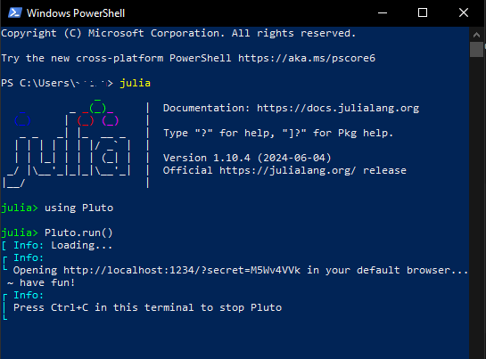

# Geothermal Energy System Simulation Using Finite Element Methods in Julia

FH Aachen - Energy Economy and Informatics M.Sc.

Created by: Filzah Asyrif Fiantama

Supervised by: Prof. Dr. rer. nat. Darius Mottaghy

#### Quick access to the pluto notebooks
- [Solving a simple Poisson problem](https://filzahfiantama.github.io/FEMJuliawithGridap/Intro_PDEFEM/IntroFEM_Gridap.html)
- 

## 1. Introduction

### 1.1 Project Overview
This Repository is a documentation for a project work as part of my master study within the scope of Geothermal Energy Systems. Simulation of a geothermal model was conducted in the lecture using python. Because the simulation is implemented using Finite Element Method, the python module FENiCs comes in handy and is the building stone of the simulation examples in the lecture.

### 1.2. Goal of the Project

As an alternative for python, Julia was mentioned to have a similarly easy to understand syntax but coupled with a high performance especially in scientific computing. Through this project, we hope to find out the feasibility of implementing FEM (for example starting with solving a simple partial difference equation) as well as the pros and cons of using Julia to simulate a more sophisticated geothermal model.

## 2. Tools and Environment

### 2.1. Julia

The first thing this project needs is of course Julia on our machine. As an open-source programming language, installing Julia is not at all complicated. https://julialang.org/downloads/ covers the installation of Julia on all operating systems.

#### Julia's REPL

REPL stands for (Read-Eval-Print Loop) and is my best friend in this project, as this command-line interface allow me to execute Julia commands, snippets of code or more relevant, to run a pluto notebook, which will be introduced in chapter 3.1. Opening Julia REPL is as easy as mentioning 'julia' in terminal.


### 2.2. Package Management Pkg

Libraries in python are called Packages in Julia. A close equivalent to 'pip' is here the package management through 'Pkg'. I will touch only on how to add new packages using Pkg. A more detailed documentation is available under https://pkgdocs.julialang.org/v1/.

Pkg also comes with a REPL that can be accessed by inputting closing square bracket ']', as shown in the picture below. The picture also demonstrates how a package is added through this REPL.


## 3. Julia Packages

This chapters touches a little bit on the necessary packages within the scope of this project. As mentioned in the previous chapter, all packages can be installed using 'Pkg.add("Package name")'.

### 3.1. Pluto Notebook

Pluto Notebook is known for its reactivity and interactivity. Both allows for a more flexible design that suits the need. After having Pluto installed through Pkg, it has to be imported then run in the Julia REPL. As the output says in the REPL, a Pluto Notebook instance will be opened in the default browser.



### 3.2. PlutoUI

PlutoUI adds interactive UI elements to Pluto notebooks. Most common usage is to create a table of content that can automatically recognize heading titles in the markdown cells in Pluto Notebook. In this notebook, PlutoUI helps displaying saved images in markdown cells.

### 3.3. Gridap

Gridap is an open-source project and it stands for 'grid approximation'(?). As the name states, it offers tools for numerical approximations. In this project, partial differential equations are to be solved using the FEM.

**Within this project, I interacted with following sites the most:**
- [Gridap.jl Documentation](https://gridap.github.io/Gridap.jl/stable/) to look up for informations. Unfortunately not all methods are well documented, or at least it is still in development.
- [Tutorials on using Gridap.jl](https://gridap.github.io/Tutorials/dev/#Introduction-1) to compliment the documentation, where Gridap package is put to use with various use cases. These tutorials helped me find a suitable use of Gridap for my specific need.

### 3.4. Gmsh

Gmsh is an open-source three-dimensional finite element mesh generator and through this same named Julia package, mesh can be generated inside Julia to avoid going back and forth between Pluto Notebook and the GMSH software.

### 3.5. GridapGmsh

This package serves as a bridge to integrate Gridap and Gmsh, such as reading the mesh files generated by Gmsh.


__________________________________________________________________________________________________________________
### Important links for materials used as references within this project:

#### Creating models from scratch
- [2D Ocean Model within the 'Introduction to Computational Thinking' Project](https://computationalthinking.mit.edu/Fall23/climate_science/2d_advection_diffusion/), with a [Video explanation](https://www.youtube.com/live/waOzCGDNPzk?si=1a5TezNueDXqocEf)

#### Utilizing an open source Julia Package Gridap.jl
- [Gridap.jl Documentation](https://gridap.github.io/Gridap.jl/stable/)
- [Tutorials on using Gridap.jl](https://gridap.github.io/Tutorials/dev/#Introduction-1)
- [An example I made recreating a simple Poisson Problem from a python notebook](https://filzahfiantama.github.io/FEMJuliawithGridap/IntrowithGmsh.html)The Pluto Notebook(s) in this repository will be deployed as a static html page with the help of the "static-export-template" github repository explained below.

__________________________________________________________________________________________________________________
To access the Dashboard containing links to each notebook click here: [Dashboard](https://filzahfiantama.github.io/FEMJuliawithGridap/)


__________________________________________________________________________________________________________________
## *This Repository uses a GitHub Template Repository to enable deployment of Pluto Notebook*
To credit the template i will insert informations on it below

# static-export-template

This is a demo repository containing two [Pluto](https://github.com/fonsp/Pluto.jl) notebooks that are **automatically converted to HTML** by a github action, and published to github pages! 🌝

See the github pages deployment of this repository:
https://juliapluto.github.io/static-export-template/

# How to use the template

### 👉 Step 1

Create a GitHub account, and click on ["Use this template"](https://github.com/JuliaPluto/static-export-template/generate). Choose a new name!


You now have your own repository (take a look at the URL), containing a copy of the template files, including the file you are currently reading (`README.md`)!

### 👉 Step 2

Click on **Add files** (or **+**), and then **Upload files**. In the next page, upload your `.jl` notebook files.


Your notebooks will run on github every time that you update the files in this repository. To check the progress, go to the ["Actions" page](./actions) of your repository, you will find the _workflow_ for the last commit.


Wait for the Action to finish running your notebook.

### 👉 Step 3

Go to the ["Settings" page](./settings) of your repository, and go to [the "Pages" section](./settings/pages). For the "Source", choose `gh-pages`. Wait a minute for everything to initialize, and the URL to your web page will be shown! 


Don't worry if it doesn't work immediately! It can take a while for the web page to be ready, even after your settings page says it's done. (Github pages says 20 minutes, but it can take even longer.)

## Update notebook files

To update an existing notebook file, simply repeat Step 2 above! (You can also use **Add files** `>` **Upload files** to _update_ upload a file that already exists on the repository.)

Are you working on this website and planning to make many changes? Then it might be nice to use [GitHub Desktop](https://github.com/apps/desktop), a program on your computer that lets you synchronise your local files with github.com more easily, without having to upload to the website each time. If you are familiar with using the terminal, then you can also use the `git` command to publish changes.

# Alternative setup: add web pages to an existing repository

If you already have a github repository with some pluto notebooks in it, you may want to add a web view like the one for this repository. In that case, the steps are slightly different. In this case, I assume that you are familiar with adding files to a repository. If not, follow the steps above.

### 👉 Step 1

From this repository, download [ExportPluto.yaml](./.github/workflows/ExportPluto.yaml). 

Save the file in your own repository, in the same location: make a folder `.github` in the main directory, within that a folder `workflows`, and add the file there, with the name `ExportPluto.yaml`. Commit the new file to your repository. 

*Note: The yaml file states that github should use the github notebooks in the `main` branch or `master` branch of your repository. If you changed the name of your default branch, or you want to use a different branch, change `main` in [line 5](https://github.com/JuliaPluto/static-export-template/blob/main/.github/workflows/ExportPluto.yaml#L5) in the yaml file to the name of your favourite branch.*

Your notebooks will run on github every time that you update the files in this repository. To check the progress, click on ["Actions"](./actions), you will find the _workflow_ for the last commit.


### 👉 Step 2

Go to the ["Settings" page](./settings) of your repository, and go to [the "Pages" section](./settings/pages). For the "Source", choose `gh-pages`. Wait a minute for everything to initialize, and the URL to your web page will be shown! 


Don't worry if it doesn't work immediately! It can take a while for the web page to be ready, even after your settings page says it's done. (Github pages says 20 minutes, but it can take even longer.)


# 💡Tips

### Julia Packages

Because Pluto has a [built-in package manager](https://github.com/fonsp/Pluto.jl/wiki/%F0%9F%8E%81-Package-management), packages will automatically work on the website!

### Default files

This files `README.md` and `My cool notebook.jl` are example files, and you can safely edit or delete them! After you have set up your repository, you can remove these setup instructions from the `README.md` file, and write a description of your project.

### Not working?

If your website is not automatically updating, then go to the **"Actions"** page of your repository, and take a look at the latest logs. If they show a ❌ symbol, then something went wrong. Click on it, and carefully read the error message. If you get stuck, be sure to ask for help: open an issue at https://github.com/JuliaPluto/static-export-template/issues/new and send us a link to your repository.

### Homepage

If you go to the (GitHub Pages) URL of repository, you will see a small index of the notebooks in this repository. You can customize this page, two options are:

-   Create your own `index.html` or `index.md` file, it will be used as the homepage.
-   Rename one of your notebooks to `index.jl`, and it will be the default notebook!

# License

This *template* repository is [Unlicensed](https://unlicense.org), which means that you can do anything you want with it! When you use this template, you are also free to remove this license message.

<details>
<summary>View license text</summary>
(This license applies to the template https://github.com/JuliaPluto/static-export-template, not necessarily to the user of the template.)

```
This is free and unencumbered software released into the public domain.

Anyone is free to copy, modify, publish, use, compile, sell, or
distribute this software, either in source code form or as a compiled
binary, for any purpose, commercial or non-commercial, and by any
means.

In jurisdictions that recognize copyright laws, the author or authors
of this software dedicate any and all copyright interest in the
software to the public domain. We make this dedication for the benefit
of the public at large and to the detriment of our heirs and
successors. We intend this dedication to be an overt act of
relinquishment in perpetuity of all present and future rights to this
software under copyright law.

THE SOFTWARE IS PROVIDED "AS IS", WITHOUT WARRANTY OF ANY KIND,
EXPRESS OR IMPLIED, INCLUDING BUT NOT LIMITED TO THE WARRANTIES OF
MERCHANTABILITY, FITNESS FOR A PARTICULAR PURPOSE AND NONINFRINGEMENT.
IN NO EVENT SHALL THE AUTHORS BE LIABLE FOR ANY CLAIM, DAMAGES OR
OTHER LIABILITY, WHETHER IN AN ACTION OF CONTRACT, TORT OR OTHERWISE,
ARISING FROM, OUT OF OR IN CONNECTION WITH THE SOFTWARE OR THE USE OR
OTHER DEALINGS IN THE SOFTWARE.

For more information, please refer to <https://unlicense.org>
```
</details>
